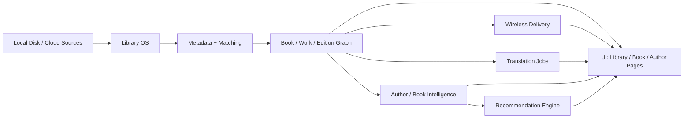

# Core Pillars Architecture

## Product Core

The product is organized around five pillars:

1. Library OS
2. Wireless Delivery
3. Translation
4. AI Author / Book Intelligence
5. AI Recommendations

Desktop reading remains a supporting utility, not the center of the system.

## System View

## Responsibility Split

### Library OS
- import
- deduplication
- work vs edition matching
- translator / publisher / series normalization
- ownership state

### Wireless Delivery
- registered devices
- preferred device rules
- format compatibility
- delivery jobs and retry states

### Translation
- passage and book-level jobs
- provider selection
- study mode vs fast mode
- glossary and terminology layer

### AI Author / Book Intelligence
- author summaries
- bibliography intelligence
- recurring themes
- entry points
- book-level thematic profiles

### AI Recommendations
- similar books
- similar authors
- explanation layer
- recommendation confidence and signals

## Build Rule

If a feature does not clearly strengthen one of these pillars, it should not be on the critical path.
